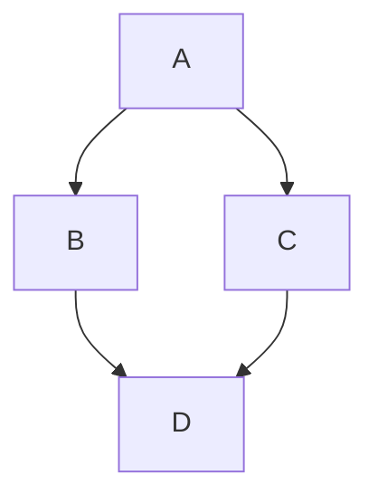

21st century Billboard Charts Analysis

This project grabs the [Billboard Hot 100]([url](https://www.billboard.com/charts/hot-100/)) every week from 2000 - Present Day and uses Airflow and a number of Different API's to transform and ingest data into a postgres database. I then ran some analytics on this database and presented a dashboard - this is deployed at [(link)](url).

## Backfill Command

docker compose exec airflow-scheduler \
    airflow backfill create\
    --dag-id weekly_billboard_pipeline \
    --from-date 2000-01-01 \
    --to-date 2025-12-09

## copy backfill Bash script into scheduler:
docker cp backfill_yearly.sh billboard-charts-analysis-airflow-scheduler-1:/opt/airflow/backfill_yearly.sh

## exec into container:

- docker compose exec --user root airflow-scheduler bash

## Run in container:

- chmod +x /opt/airflow/backfill_yearly.sh
- /backfill_yearly.sh

docker compose exec airflow-scheduler bash

airflow tasks state weekly_billboard_pipeline load_weekly_music_data 2000-01-07

airflow dags list-runs weekly_billboard_pipeline

docker compose exec postgres psql -U airflow airflow

\list
\c music_warehouse
\dt
select * from chart_weeks

DELETE FROM dag_run WHERE dag_id='weekly_billboard_pipeline';
DELETE FROM task_instance WHERE dag_id='weekly_billboard_pipeline';

## Dashboard Deployment

To deploy the Streamlit dashboard on your Digital Ocean server, see the deployment guide:

- **Quick Start**: See `deploy/QUICK_START.md` for the fastest deployment path
- **Full Guide**: See `deploy/DEPLOYMENT.md` for detailed deployment options including:
  - Systemd service deployment (recommended)
  - Docker deployment
  - Nginx reverse proxy setup
  - Digital Ocean App Platform

The dashboard requires a `MUSIC_WAREHOUSE_DATABASE_URL` environment variable pointing to your PostgreSQL database.
